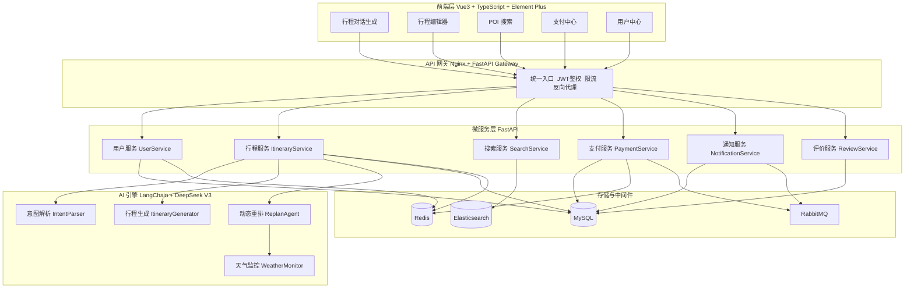

# 智游 SmartTravel 🧳

> **AI 驱动的个性化智能行程规划与动态调整平台**

用自然语言描述你的旅行需求，AI 在数分钟内生成可用的完整行程方案；旅途中遇到天气变化、航班延误，一键自动重排，打造从"想出门"到"玩完回家"的全链路闭环体验。

---

## ✨ 核心特性

- **🧠 AI 智能行程生成**：基于 DeepSeek V3 + LangChain + LangGraph 的多 Agent 协作，自然语言直接输出结构化行程 JSON
- **🔄 动态重排能力**：国内首创事件驱动自动重排，天气突变、航班延误时 AI 自动推送备选方案
- **🔍 智能 POI 搜索**：Elasticsearch 支持景点、酒店、餐饮、交通等多维搜索，Redis 缓存加速
- **💳 一键预订闭环**：集成支付宝沙箱支付，支持延迟支付、订单锁定、超时自动释放
- **📨 实时消息通知**：RabbitMQ 驱动的异步通知服务，WebSocket 实时推送行程变更
- **👤 用户体系**：阿里云短信验证登录，JWT 鉴权，Pro 会员订阅
- **⭐ 评价反馈系统**：行程评价、商家反馈、数据闭环优化推荐

---

## 🏗️ 系统架构



---

## 📦 技术栈

### 前端

- Vue 3 + TypeScript + Vite
- Element Plus + Pinia + Vue Router
- Axios + vuedraggable（行程拖拽重排）
- Sass/SCSS + animate.css + swiper

### 后端

- Python 3.10+ + FastAPI + Uvicorn
- SQLAlchemy 2.0 (async) + Pydantic v2 + Alembic
- aiomysql + redis-py + aio-pika
- python-jose / pyjwt + bcrypt + python-dotenv

### AI / LLM

- LangChain + langchain-openai + LangGraph
- DeepSeek V3（主引擎）
- Dify（保留兼容性）

### 存储与中间件

- MySQL 8.4 + Redis 7.2 + Elasticsearch 8.15 + RabbitMQ 3.13

### 外部 API

- 高德地图 API（POI / 地理编码 / 路线规划）
- 和风天气 API（实时天气 / 预警）
- 支付宝沙箱 API（支付）
- 阿里云短信 API（登录验证）

### 部署

- Docker + Docker Compose + Nginx 反向代理 + Docker Bridge Network

---

## 📂 项目结构

```
smarttravle/
├── backend/                    # 后端微服务
│   ├── common/                 # 公共库（JWT、模型基类、MQ、工具函数）
│   ├── gateway/                # API 网关（鉴权 + 反向代理）
│   ├── user-service/           # 用户服务（注册/登录/短信/会员）
│   ├── itinerary-service/      # 行程服务（AI生成/重排/CRUD）
│   ├── search-service/         # 搜索服务（ES 索引/缓存/检索）
│   ├── payment-service/        # 支付服务（支付宝/订单/延迟支付）
│   ├── notification-service/   # 通知服务（MQ 消费/推送）
│   └── review-service/         # 评价服务（评分/反馈）
├── frontend/                   # 前端 Vue3 项目
│   └── src/
│       ├── api/                # 接口层封装
│       ├── components/         # 组件（chat/itinerary/search/payment...）
│       ├── composables/        # 组合式函数
│       ├── stores/             # Pinia 状态管理
│       ├── views/              # 页面视图
│       ├── layouts/            # 布局组件
│       ├── router/             # 路由
│       ├── styles/             # 全局样式
│       └── types/              # TypeScript 类型
├── docker/                     # Docker 部署配置
│   ├── docker-compose.yml      # 生产部署编排
│   ├── .env.example            # 环境变量模板
│   └── nginx/nginx.conf        # Nginx 反代配置
├── dify/                       # Dify 工作流配置（兼容保留）
│   ├── intent_parser.yml
│   ├── itinerary_generator.yml
│   └── replan_agent.yml
├── scripts/                    # 初始化脚本
│   ├── init_db.sql             # MySQL 初始化
│   ├── seed_poi.py             # POI 种子数据
│   ├── seed_es.py              # ES 索引初始化
│   ├── init_es.sh
│   └── init_mq.sh
└── docs/                       # 项目文档
    ├── 智旅需求文档.md
    └── 智旅执行流程文档.md
```

---

## 🚀 快速开始

### 前置要求

- Docker Engine ≥ 24.0
- Docker Compose ≥ 2.20
- 可用的 API Key（见 [环境变量配置](#环境变量配置)）

### 一键部署（Docker Compose）

```bash
# 1. 克隆仓库
git clone https://github.com/LFMaaa/SmartTravel.git
cd smarttravle

# 2. 配置环境变量
cp docker/.env.example docker/.env
# 编辑 docker/.env，填入各 API Key

# 3. 准备支付宝密钥文件（可选，支付模块必填）
# 将 alipay_private_key.pem 和 alipay_public_key.pem
# 放入 backend/payment-service/ 目录下

# 4. 启动所有服务
cd docker
docker compose up -d

# 5. 初始化数据（MySQL 已通过 init.sql 自动初始化）
# 进入容器或本地执行，注入 ES 索引与 POI 数据
# 参见 scripts/seed_es.py 和 scripts/seed_poi.py

# 6. 查看日志
docker compose logs -f

# 7. 访问
# 前端: http://localhost/
# 网关健康检查: http://localhost:8000/health
# RabbitMQ 控制台: http://localhost:15672  (smarttravel / smarttravel123)
```

### 本地开发

**后端微服务（示例：启动用户服务）**

```bash
cd backend
pip install -r requirements.txt
cd user-service
uvicorn app.main:app --reload --port 8001
```

**前端**

```bash
cd frontend
npm install
npm run dev      # http://localhost:5173
```

---

## 🔧 环境变量配置

关键变量一览（完整模板见 `docker/.env.example`）：

| 变量 | 说明 |
|------|------|
| `JWT_SECRET_KEY` | JWT 签名密钥 |
| `DEEPSEEK_API_KEY` | DeepSeek V3 API Key（AI 核心） |
| `AMAP_API_KEY` | 高德地图 Key（POI / 路线） |
| `ALIBABA_CLOUD_ACCESS_KEY_ID` | 阿里云 AK（短信） |
| `ALIBABA_CLOUD_ACCESS_KEY_SECRET` | 阿里云 SK |
| `ALIPAY_APP_ID` | 支付宝沙箱 APPID |
| `ALIPAY_NOTIFY_URL` | 支付宝异步回调地址（需公网可访问） |
| `MYSQL_*` / `REDIS_*` / `RABBITMQ_*` | 中间件账号 |

---

## 🌐 服务端口映射

| 服务 | 容器端口 | 宿主机端口 |
|------|:--------:|:----------:|
| Nginx（统一入口） | 80 | 80 |
| Frontend | 80 | 5173 |
| API Gateway | 8000 | 8000 |
| User Service | 8001 | 8001 |
| Itinerary Service | 8002 | 8002 |
| Search Service | 8003 | 8003 |
| Payment Service | 8004 | 8004 |
| Notification Service | 8005 | 8005 |
| Review Service | 8007 | 8007 |
| MySQL | 3306 | 3307 |
| Redis | 6379 | 6379 |
| Elasticsearch | 9200 | 9200 |
| RabbitMQ | 5672 / 15672 | 5672 / 15672 |

---

## 🧩 核心业务流程

### 1. AI 行程生成

```
用户自然语言输入
    → 意图解析（IntentParser）提取：目的地 / 天数 / 预算 / 风格 / 禁忌
    → 搜索服务（ES）拉取候选 POI
    → 高德 API 获取路线时间、距离
    → LangGraph 多 Agent 约束求解（预算/时间/体能/天气）
    → SSE 流式推送结构化 Day → Activity 行程
    → 行程编辑器可视化展示，支持拖拽重排
```

### 2. 动态重排（事件驱动）

```
天气预警 / 航班延误 / 用户主动重排请求
    → MQ 发布 replan.triggered 事件
    → 通知服务推送 ReplanAlert 给前端（WebSocket）
    → ReplanAgent 基于当前行程 + 新约束重新生成
    → 行程版本切换（VersionSelector），用户可对比 A/B
```

### 3. 预订闭环

```
用户在行程中勾选资源 → 提交订单
    → 支付服务创建订单（状态：pending + 倒计时）
    → Redis 分布式锁锁定库存
    → 调起支付宝沙箱收银台
    → 用户支付成功 / 超时 MQ 延迟队列触发自动取消
    → 异步回调更新订单 → 推送通知
```

---

## 🧪 核心亮点

- **微服务 + 事件驱动**：6 个 FastAPI 微服务 + 网关 + MQ 解耦，职责清晰
- **AI 全链路**：LangGraph 多 Agent 协作，Prompt + 工具调用可追踪可迭代
- **可视化行程编辑器**：拖拽排序、时间线视图、预算条、地图 Popup、版本切换
- **高并发设计**：Redis 缓存搜索热词、分布式锁、MQ 削峰、延迟队列
- **一键部署**：Docker Compose 13+ 容器健康检查联动，开箱即用

---

## 📝 文档

- [产品需求文档 PRD](docs/智旅需求文档.md)
- [项目执行流程文档](docs/智旅执行流程文档.md)

---

## 🤝 开源协议

本项目用于学习与演示。
