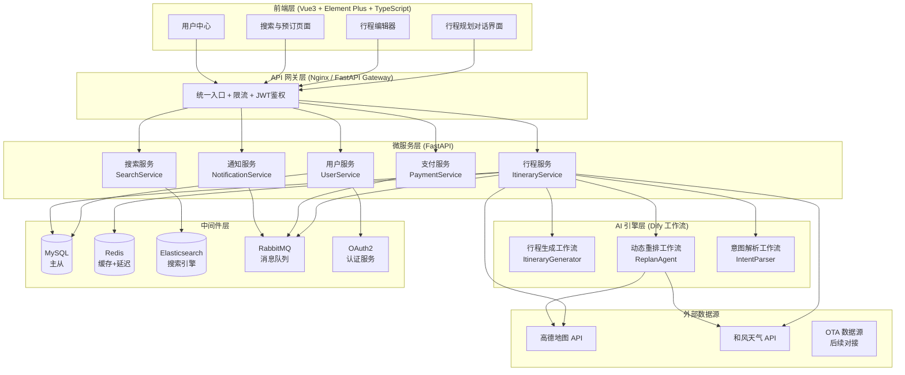
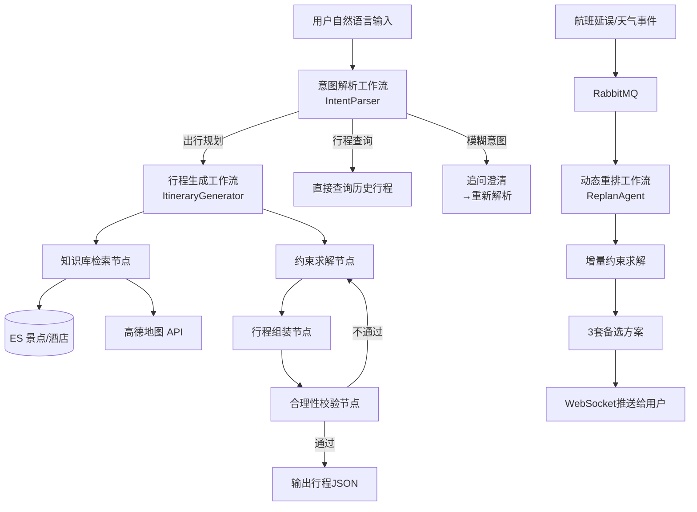
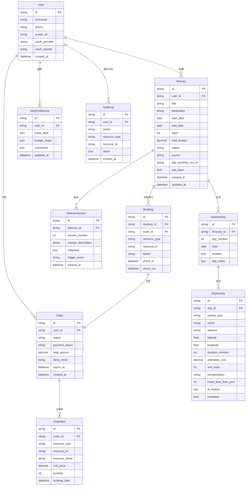
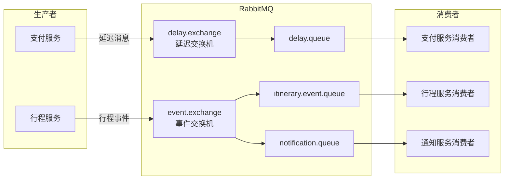
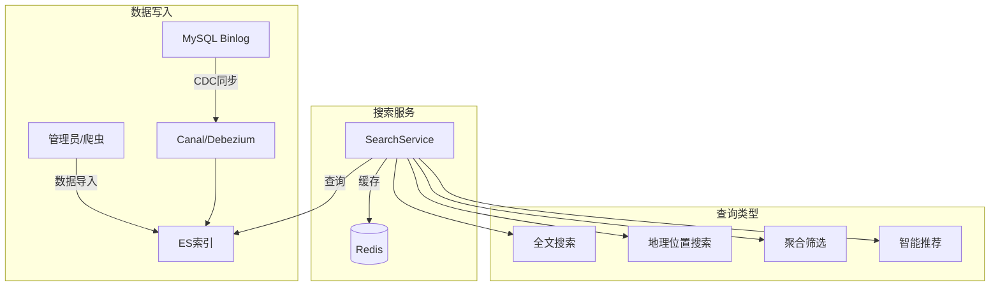

# 智游（SmartTravel）—— AI 智能行程规划与动态调整平台 产品需求文档（PRD）

---

**文档版本**：V1.0  
**创建日期**：2026-06-18  
**作者**：SmartTravel 项目组  
**状态**：草案  

---

## 目录

1. [产品概述](#1-产品概述)
2. [市场背景与竞品分析](#2-市场背景与竞品分析)
3. [系统架构总览](#3-系统架构总览)
4. [功能需求（FR）](#4-功能需求fr)
5. [非功能需求（NFR）](#5-非功能需求nfr)
6. [AI 工作流设计（Dify）](#6-ai-工作流设计dify)
7. [数据模型设计](#7-数据模型设计)
8. [API 接口规范](#8-api-接口规范)
9. [前端页面规划](#9-前端页面规划)
10. [消息队列与异步处理（RabbitMQ）](#10-消息队列与异步处理rabbitmq)
11. [搜索引擎设计（Elasticsearch）](#11-搜索引擎设计elasticsearch)
12. [里程碑与迭代计划](#12-里程碑与迭代计划)
13. [风险与应对](#13-风险与应对)
14. [附录](#14-附录)

---

## 1. 产品概述

### 1.1 产品愿景

打造一套面向自由行游客的 **AI 驱动的个性化行程规划与实时动态调整平台**，让用户通过自然语言描述需求，即可在数分钟内获得"可用"的完整行程方案，并在行程变动时自动重排。

本产品从"信息聚合工具"升级为"AI 旅行代理"——用户不再需要跨平台搜攻略、比价格、手动拼行程，而是由 AI 完成"意图理解 → 行程生成 → 一键预订 → 动态调整"的全链路闭环。

### 1.2 产品定位

| 维度 | 说明 |
|------|------|
| **品类** | AI 旅行代理（Agent），而非传统 OTA |
| **核心差异** | 从"给你看攻略，你自己拼"升级为"直接端上来一桌配好的菜" |
| **目标人群** | 自由行游客（占比63%，且持续增长），尤其是有预算、无时间的年轻白领 |
| **商业模型** | C端会员订阅 + B端交易抽佣 + 数据变现 + B2B API输出 |

### 1.3 目标用户

| 用户角色 | 描述 | 核心需求 |
|----------|------|----------|
| **自由行游客（C端）** | 有出行意愿，但不想花10+小时规划行程 | "帮我规划成都4日游，预算3000，喜欢美食历史，不要爬山" |
| **行程管理者** | 正在旅途中，遇到航班延误/天气变化需要重排 | "航班取消了，帮我重新安排今天下午和明天的行程" |
| **平台运营（B端商家）** | 酒店/景区/旅行社，希望获取精准流量 | "让我的酒店出现在成都美食之旅的行程推荐中" |
| **系统管理员** | 平台运维人员 | 监控服务健康状态、处理异常订单、管理商家入驻 |

### 1.4 核心价值主张

- **效率革命**：从10小时手动规划 → 10分钟 AI 出方案，效率提升 98%
- **个性化**：基于用户偏好（预算/风格/体能/禁忌）和上下文（季节/天气/实时价格）生成千人千面的行程
- **动态适应**：国内首创的"航班延误→自动重排行程"能力，旅途中突变不再手足无措
- **闭环体验**：规划→预订→调整，一个平台完成，无需跨 App 操作
- **商业闭环**：C端订阅 + B端抽佣 + 数据变现，盈利路径清晰

### 1.5 商业模式

| 收入线 | 产品 | 定价策略 | 目标转化率 |
|--------|------|----------|:---:|
| **C端订阅** | Pro 会员（无限行程/动态调整/历史行程库） | ¥29/月 或 ¥199/年 | 15% |
| **C端增值** | 深度AI定制 + 人工审核 | ¥49-99/次 | 5% |
| **B端抽佣** | 酒店/机票/门票/餐饮预订佣金 | GMV 的 5%-12% | 30%（预订转化） |
| **B端推广** | 搜索结果竞价排名、坑位推荐 | CPC ¥2-10 / 固定坑位费 | - |
| **B端SaaS** | 中小旅行社店铺管理 + 数据分析工具 | ¥999-2999/年/商家 | - |
| **数据变现** | 旅游趋势报告 / 用户画像数据API | ¥5000-20万 | - |
| **B2B API** | AI行程规划API输出 | ¥0.05-0.3/次 | - |

---

## 2. 市场背景与竞品分析

### 2.1 行业痛点

| 痛点 | 严重程度 | 描述 |
|------|:---:|------|
| **体验同质化 + 供需错配** | 极高 | 78.3%游客追求个性化体验，但市场90%仍是标准化产品；"买家秀和卖家秀落差太大" |
| **行程规划效率低** | 高 | 跨多平台比价拼行程，一次7天旅行平均耗时10-20小时 |
| **突发变动无应对** | 极高 | 航班延误/天气变化/景区关闭 → 用户只能手动逐一改签，至少折腾2-3小时 |
| **价格不透明** | 极高 | 低价引流后临时加价，异地转包导致服务失控 |
| **信息过载** | 高 | 攻略太多但真假难辨，用户陷入"选择瘫痪" |

### 2.2 竞品对比

| 维度 | 携程/美团 | 马蜂窝/穷游 | ChatGPT + 手动订 | **智游（本产品）** |
|------|-----------|------------|-----------------|-------------------|
| **模式** | 搜索比价 → 下单 | UGC攻略 + 预订 | AI建议 + 跨平台手动操作 | **AI生成 + 一键预订 + 动态调整** |
| **行程生成** | ❌ 不支持 | ❌ 不支持 | ⚠️ 需要用户自行prompt | **✅ 自然语言 → 完整行程JSON** |
| **个性化** | 基于历史订单推荐 | 基于浏览推荐 | 依赖Prompt质量 | **多维度偏好模型（预算/风格/体能/禁忌）** |
| **动态调整** | ❌ 仅发通知，用户自己改 | ❌ 不支持 | ❌ 不支持 | **✅ 事件驱动自动重排，推送备选方案** |
| **预订闭环** | ✅ 单品类预订 | ✅ 部分品类 | ❌ 需跳转多个App | **✅ 一键预订全链路** |
| **技术架构** | 单体/SOA | 单体 | N/A | **微服务 + 事件驱动** |

### 2.3 差异化优势

1. **品类升维**：不是"搜索工具"而是"AI旅行代理"——替代用户的搜索、比较、拼装、调整过程
2. **动态调整能力**：国内首个实现"事件驱动自动重排"的平台，依赖 MQ + AI + 实时库存 + 延迟支付四者联动
3. **Dify 工作流驱动**：AI行程生成逻辑可视化编排，非技术人员也能参与优化；多Agent协作（偏好解析→知识检索→约束求解→行程组装）
4. **双边网络效应**：用户越多 → 偏好数据越丰富 → AI推荐越精准 → 用户粘性越高 → 吸引更多商家 → 供给更丰富
5. **全链路闭环**：从"想出门"到"玩完回家"，一个平台覆盖

### 2.4 市场规模

| 指标 | 数据 |
|------|------|
| 中国在线旅游市场规模（2025） | ¥1.2万亿+ |
| 自由行占比 | 63%（且持续增长） |
| 自由行用户最大痛点 TOP1 | 行程规划耗时 |
| 可触达市场（SAM） | 自由行用户中的AI工具使用者 ≈ ¥200亿+ |

---

## 3. 系统架构总览

### 3.1 整体架构图



### 3.2 技术选型详解

| 层级 | 技术 | 版本 | 选型理由 |
|------|------|------|----------|
| **后端语言** | Python | 3.12+ | AI/ML 生态丰富，FastAPI 异步高性能 |
| **Web 框架** | FastAPI | 0.115+ | 异步非阻塞，原生SSE支持，自动OpenAPI文档 |
| **ORM** | SQLAlchemy | 2.0+ | 异步支持（async session），迁移工具Alembic |
| **ASGI 服务器** | Uvicorn | 0.30+ | 轻量高性能，完美配合 FastAPI |
| **前端框架** | Vue3 | 3.5+ | Composition API，TypeScript原生支持 |
| **UI 组件库** | Element Plus | 2.9+ | Vue3生态最成熟组件库，行程编辑器可定制 |
| **前端构建** | Vite | 6.0+ | 极速冷启动，HMR热更新 |
| **前端语言** | TypeScript | 5.5+ | 类型安全，大型项目可维护性 |
| **AI 工作流引擎** | Dify | 1.0+ | 可视化Agent编排，多工作流协作，内置知识库 |
| **关系数据库** | MySQL | 8.4+ | 成熟稳定，主从读写分离 |
| **缓存数据库** | Redis | 7.2+ | 热点行程缓存、Session、延迟队列、分布式锁 |
| **搜索引擎** | Elasticsearch | 8.15+ | 全文检索、聚合分析、地理位置搜索 |
| **消息队列** | RabbitMQ | 3.13+ | 延迟消息（插件）、可靠投递、多交换机路由 |
| **认证协议** | OAuth2 + JWT | - | 第三方登录（微信/支付宝），微服务间鉴权 |
| **数据验证** | Pydantic | 2.9+ | 运行时类型检查，与FastAPI深度集成 |
| **HTTP 客户端** | httpx | 0.27+ | 异步HTTP调用（Dify API、外部数据源） |
| **前端状态管理** | Pinia | 2.2+ | Vue3官方推荐，TypeScript友好 |
| **前端路由** | Vue Router | 4.4+ | Vue3官方路由 |
| **部署环境** | Docker + VMware | - | Docker Compose编排，虚拟机集群部署 |

### 3.3 微服务模块划分

```
smart-travel/
├── backend/                           # 后端微服务（Python / FastAPI）
│   ├── gateway/                       # API 网关服务
│   │   ├── app/
│   │   │   ├── middleware/            # JWT鉴权、限流、CORS
│   │   │   ├── proxy/                 # 服务路由转发
│   │   │   └── main.py
│   │   └── Dockerfile
│   ├── user-service/                  # 用户服务
│   │   ├── app/
│   │   │   ├── api/                   # 路由：注册/登录/OAuth/OAuth2回调
│   │   │   ├── models/                # SQLAlchemy 模型：User、UserProfile
│   │   │   ├── services/              # 业务逻辑：认证、授权、用户信息
│   │   │   ├── schemas/               # Pydantic 请求/响应模型
│   │   │   └── main.py
│   │   └── Dockerfile
│   ├── itinerary-service/             # 行程服务（核心）
│   │   ├── app/
│   │   │   ├── api/                   # 路由：行程生成/CRUD/动态调整
│   │   │   ├── models/                # SQLAlchemy 模型：Itinerary、Day、Activity
│   │   │   ├── services/              # AIService、ReplanService、ConstraintSolver
│   │   │   ├── schemas/               # 行程JSON Schema
│   │   │   ├── dify/                  # Dify API客户端封装
│   │   │   └── main.py
│   │   └── Dockerfile
│   ├── search-service/                # 搜索服务
│   │   ├── app/
│   │   │   ├── api/                   # 路由：景点搜索/酒店搜索/全文检索
│   │   │   ├── services/              # ESService、GeoService
│   │   │   ├── es/                    # ES索引Mapping定义
│   │   │   └── main.py
│   │   └── Dockerfile
│   ├── payment-service/               # 支付服务
│   │   ├── app/
│   │   │   ├── api/                   # 路由：创建订单/支付回调/退款
│   │   │   ├── models/                # SQLAlchemy 模型：Order、Transaction
│   │   │   ├── services/              # DelayPaymentService、OrderService
│   │   │   └── main.py
│   │   └── Dockerfile
│   ├── notification-service/          # 通知服务
│   │   ├── app/
│   │   │   ├── api/                   # WebSocket连接管理
│   │   │   ├── services/              # PushService、MQ Consumer
│   │   │   └── main.py
│   │   └── Dockerfile
│   └── common/                        # 公共模块（pip install -e .）
│       ├── models/                    # 共享SQLAlchemy基类
│       ├── schemas/                   # 共享Pydantic模型
│       ├── auth/                      # JWT生成/验证工具
│       └── utils/                     # 通用工具函数
├── frontend/                          # 前端（Vue3 + TypeScript）
│   ├── src/
│   │   ├── views/                     # 页面视图
│   │   ├── components/                # 通用组件
│   │   ├── composables/               # 组合式函数
│   │   ├── stores/                    # Pinia 状态管理
│   │   ├── api/                       # API 客户端
│   │   ├── router/                    # 路由配置
│   │   └── types/                     # TypeScript 类型定义
│   └── vite.config.ts
├── dify/                              # Dify 工作流导出文件
│   ├── intent_parser.yml              # 意图解析工作流
│   ├── itinerary_generator.yml        # 行程生成工作流
│   └── replan_agent.yml               # 动态重排工作流
├── docker/                            # Docker 编排
│   ├── docker-compose.yml             # 开发环境
│   ├── docker-compose.prod.yml        # 生产环境（VMware集群）
│   └── nginx/                         # Nginx 配置
├── scripts/                           # 脚本
│   ├── init_db.sql                    # MySQL 初始化
│   ├── init_es.sh                     # ES 索引创建
│   └── init_mq.sh                     # RabbitMQ 交换机/队列创建
├── prd/                               # PRD 文档
└── docs/                              # 技术文档
```

---

## 4. 功能需求（FR）

### 4.1 行程规划核心链路

#### FR-01：AI 智能行程生成

| 字段 | 内容 |
|------|------|
| **优先级** | P0（核心） |
| **描述** | 用户通过自然语言输入出行需求，AI 工作流生成完整、可用的行程方案 |
| **输入示例** | "我想带父母去北京5天，预算1.5万，喜欢历史文化，腿脚不太好，不要爬山的景点" |
| **输出示例** | 含每日上午/下午/晚餐/酒店的完整JSON行程，标注预算、体能消耗、禁忌过滤 |
| **验收标准** | 1. 支持自然语言输入（不少于50字描述） 2. 生成结果含每日时间轴（上午/午餐/下午/晚餐/酒店） 3. 总预算不超过用户上限的110% 4. 自动过滤用户禁忌（如"不爬山"排除香山/长城徒步） 5. 自动考虑地理位置合理性（相邻活动不超过5公里） 6. 生成时间 < 60s 7. 支持流式输出（SSE），用户可见生成过程 |

#### FR-02：行程编辑器（交互式调整）

| 字段 | 内容 |
|------|------|
| **优先级** | P0（核心） |
| **描述** | 用户可对AI生成的行程进行拖拽调整、增删活动、替换酒店等操作 |
| **验收标准** | 1. 时间轴视图展示每日行程 2. 支持拖拽调整活动顺序 3. 点击活动弹出详情面板（地址/评分/价格/图片） 4. 修改行程后实时更新总预算 5. 支持撤销/重做 6. 替换活动时显示AI推荐备选 |

#### FR-03：行程版本管理

| 字段 | 内容 |
|------|------|
| **优先级** | P1（重要） |
| **描述** | 保存行程的多个版本，支持在版本间切换，方便对比不同方案 |
| **验收标准** | 1. 每次重大修改自动保存为新版本 2. 支持手动创建版本快照 3. 版本列表展示修改时间和摘要 4. 支持版本对比（高亮差异） |

### 4.2 动态调整（核心差异化）

#### FR-04：航班延误/取消 → 自动重排行程

| 字段 | 内容 |
|------|------|
| **优先级** | P0（核心——这是项目最大的差异化） |
| **描述** | 系统感知航班变动事件后，自动重新规划受影响时段的行程，并推送备选方案 |
| **触发事件** | 航班延误/取消、天气预警、景区临时关闭 |
| **处理流程** | 1. RabbitMQ 接收事件 2. Dify 动态重排工作流触发 3. 生成 3 套备选方案 4. Redis 锁定新资源（15分钟TTL） 5. WebSocket 推送给用户 6. 用户一键确认或手动选择 |
| **验收标准** | 1. 从事件接收到方案推送 < 30s 2. 备选方案 ≥ 2套 3. 新方案预算不超过原方案 120% 4. 新方案自动顺延酒店/门票预约 5. 备选资源15分钟超时自动释放 6. 用户操作日志完整记录（面试时可演示审计追踪） |

#### FR-05：行程实时提醒

| 字段 | 内容 |
|------|------|
| **优先级** | P1（重要） |
| **描述** | 途中推送时间节点提醒（值机提醒、酒店入住时间、预约景点时间等） |
| **验收标准** | 1. 支持WebSocket实时推送 2. 支持短信/邮件降级通道（预留接口） 3. 用户可自定义提醒时间偏移量 |

### 4.3 搜索与发现

#### FR-06：智能景点/酒店搜索

| 字段 | 内容 |
|------|------|
| **优先级** | P1（重要） |
| **描述** | 基于 Elasticsearch 的多维度搜索（关键词 + 地理位置 + 价格区间 + 标签筛选） |
| **验收标准** | 1. 全文检索延迟 < 200ms 2. 支持按目的地城市/区域筛选 3. 支持按价格区间/评分/标签筛选 4. 支持地理位置搜索（"故宫附近3公里内的酒店"） 5. 搜索结果按AI推荐度排序（结合用户偏好） 6. 支持搜索建议和自动补全 |

#### FR-07：热门行程推荐（首页Feed）

| 字段 | 内容 |
|------|------|
| **优先级** | P2（一般） |
| **描述** | 基于用户偏好和季节/热点事件，推荐热门行程模板 |
| **验收标准** | 1. 首页展示精选行程卡片 2. 支持分类浏览（美食/文化/亲子/户外） 3. 热门行程数据来自Redis缓存，每30分钟刷新 4. 点击行程卡片可一键"克隆到我的行程" |

### 4.4 预订与支付

#### FR-08：一键预订全链路

| 字段 | 内容 |
|------|------|
| **优先级** | P1（重要） |
| **描述** | 用户在行程编辑器中确认后，一键预订行程中的酒店/门票（MVP阶段至少实现预约占位） |
| **验收标准** | 1. 行程确认后显示预订清单（每项待预订资源的详情） 2. 支持逐个确认或一键全选 3. 预订失败项红色标注，提供备选推荐 |

#### FR-09：延迟支付（占位锁资源）

| 字段 | 内容 |
|------|------|
| **优先级** | P1（重要） |
| **描述** | 订单创建后通过 Redis + RabbitMQ 延迟消息实现15分钟占位，超时自动释放 |
| **流程** | 1. 用户确认预订 → 创建订单（status=PENDING） 2. Redis 记录资源占位 + 15分钟过期 3. RabbitMQ 投递延迟消息 4. 15分钟内支付 → 确认资源 5. 15分钟超时 → 消费者释放资源 → 订单标记TIMEOUT |
| **验收标准** | 1. 占位期间资源不可被其他人预订 2. 超时自动释放（误差 < 5s） 3. 支付前倒计时展示在前端 4. 支持手动取消占位 |

### 4.5 用户系统

#### FR-10：OAuth2 第三方登录

| 字段 | 内容 |
|------|------|
| **优先级** | P0（核心） |
| **描述** | 支持微信扫码登录和支付宝登录，降低注册门槛 |
| **验收标准** | 1. 微信OAuth2.0授权码模式 2. 首次登录自动创建用户 3. 绑定手机号后可用手机号+验证码登录 4. 已绑定用户自动关联 |

#### FR-11：JWT 双Token鉴权

| 字段 | 内容 |
|------|------|
| **优先级** | P0（核心） |
| **描述** | Access Token（15分钟）+ Refresh Token（7天）双Token机制 |
| **验收标准** | 1. Access Token过期返回401 2. 前端自动用Refresh Token换取新Access Token 3. Refresh Token过期要求重新登录 4. Token内包含用户角色，微服务间传递鉴权 |

### 4.6 用户中心

#### FR-12：我的行程库

| 字段 | 内容 |
|------|------|
| **优先级** | P1（重要） |
| **描述** | 展示用户所有历史行程，支持分类（已出行/计划中/草稿） |
| **验收标准** | 1. 卡片式列表展示 2. 支持按状态筛选 3. 支持搜索历史行程目的地 4. 可复制历史行程创建新行程 |

---

## 5. 非功能需求（NFR）

### 5.1 性能

| 指标 | 目标值 | 测量方式 |
|------|--------|----------|
| 行程生成时间 | < 60s（含Dify工作流+数据检索） | 端到端计时 |
| ES 搜索延迟 | < 200ms（P99） | 压力测试 |
| 动态重排响应 | < 30s（事件接收→方案推送） | 端到端计时 |
| 首页加载时间 | < 2s（含热门行程卡片） | Lighthouse |
| API 响应时间（非AI） | < 500ms（P99） | Prometheus |
| 并发用户数 | ≥ 1000 | 压力测试工具 |

### 5.2 可用性

| 指标 | 目标值 |
|------|--------|
| 核心服务可用率 | ≥ 99.5% |
| 故障恢复时间 | < 30min |
| 数据备份频率 | 每日全量（MySQL）+ 每小时增量 |
| 降级策略 | Dify 不可用时展示缓存结果；ES 不可用时降级为 MySQL LIKE 查询 |

### 5.3 安全性

| 要求 | 实现方式 |
|------|----------|
| API 认证 | JWT 双Token（Access 15min + Refresh 7d） |
| 第三方登录 | OAuth2 授权码模式，State 参数防 CSRF |
| 密码存储 | bcrypt 加盐哈希 |
| 敏感数据加密 | 手机号 AES-256 加密存储 |
| 传输安全 | HTTPS/TLS 1.3（VMware 内部可暂用 HTTP + 自签证书） |
| 防注入 | FastAPI 参数校验 + Pydantic 类型约束 + SQLAlchemy 参数化查询 |
| CORS | 白名单域名，禁止 `*` |
| 速率限制 | 单用户 30次/分钟，单IP 100次/分钟（网关层 Redis 滑动窗口） |
| 敏感操作审计 | 行程修改、支付操作记录完整审计日志 |

### 5.4 可扩展性

- **微服务独立部署**：每个服务独立 Docker 容器，独立扩缩容
- **数据库读写分离**：MySQL 主写从读，连接池按需配置
- **ES 集群预留**：索引设计支持后续扩展至多节点集群
- **MQ 多交换机路由**：事件类型独立 Topic，消费者可插拔
- **Dify 工作流版本管理**：工作流 YAML 文件纳入 Git 版本控制
- **支付适配器模式**：PaymentService 使用策略模式，支付宝/微信支付可插拔替换
- **前端组件化**：行程编辑器、搜索面板、预订面板均为独立组件，可复用

### 5.5 可观测性

| 维度 | 工具 | 说明 |
|------|------|------|
| 日志 | structlog（Python） | 结构化JSON日志，ELK收集 |
| 指标 | Prometheus + Grafana | HTTP请求/QPS/延迟/Dify调用耗时 |
| 链路追踪 | 预留 OpenTelemetry | 跨服务调用链追踪 |
| 健康检查 | /health + /ready | K8s/Docker 探针 |

---

## 6. AI 工作流设计（Dify）

### 6.1 工作流全景



### 6.2 意图解析工作流（IntentParser）

| 属性 | 值 |
|------|-----|
| **Dify 应用类型** | Chatflow（对话流） |
| **模型** | 轻量级模型（如 GPT-4o-mini / DeepSeek-V3-Lite） |
| **温度** | 0.3（确保意图分类稳定性） |

**工作流节点**：

```
[开始] → [意图分类节点] → [条件分支]
  ├─ 行程规划类 → [实体提取节点]（提取：目的地/天数/预算/偏好/禁忌）
  │   └─ 输出结构化参数
  ├─ 行程查询类 → [参数提取] → 调用行程服务API
  ├─ 动态调整类 → [事件解析] → 传递给动态重排工作流
  └─ 其他/模糊 → [追问澄清] → [重新分类]
→ [结束]
```

**实体提取输出示例**：
```json
{
  "intent": "itinerary_planning",
  "destination": "成都",
  "days": 4,
  "budget": 3000,
  "travelers": {"adults": 1, "children": 0, "seniors": 0},
  "preferences": ["美食", "历史文化"],
  "constraints": ["不爬山", "日均步数 < 8000"],
  "travel_style": "悠闲深度",
  "season": "夏季"
}
```

### 6.3 行程生成工作流（ItineraryGenerator）⭐核心

| 属性 | 值 |
|------|-----|
| **Dify 应用类型** | Workflow（工作流） |
| **模型** | 高性能模型（如 GPT-4o / DeepSeek-V3） |
| **温度** | 0.7（保证创意性） |
| **执行时间目标** | < 60s |

**工作流节点（6步流水线）**：

```
[开始]
  ↓
① 知识库检索节点
  ├─ 向量检索：根据偏好匹配景点（ChromaDB / Dify内置知识库）
  ├─ ES 检索：根据目的地+价格区间匹配酒店
  ├─ 路线规划：高德API计算景点间距离和交通时间
  └─ 天气查询：和风API获取出行时段天气预报
  ↓
② 候选池排序节点（LLM）
  ├─ 输入：检索结果 + 用户偏好
  ├─ 输出：Top-20 景点/酒店/餐厅候选，每个标注推荐理由
  └─ Prompt：严格基于用户偏好（预算/风格/体能）排序
  ↓
③ 约束求解节点（Code节点 + LLM）
  ├─ 硬约束：总预算 ≤ 预算上限×110%、同一天活动不跨城市
  ├─ 软约束：日均步数、餐饮风格一致性、避免审美疲劳
  ├─ 时间分配：上午1-2个活动 + 午餐 + 下午1-2个活动 + 晚餐
  └─ 酒店匹配：每晚在合理区域内选择
  ↓
④ 行程组装节点（Template + LLM）
  ├─ 按天组装：day1→dayN
  ├─ 每个活动包含：名称/地址/时长/预算/推荐理由/交通方式
  └─ 生成总预算汇总
  ↓
⑤ 合理性校验节点（LLM）
  ├─ 地理合理性：同一天活动是否在同一区域
  ├─ 时间合理性：活动+交通总耗时是否超过可用时间
  ├─ 预算合理性：每日预算分配是否均匀
  └─ 不通过 → 返回③重新求解（最多重试2次）
  ↓
⑥ [结束] 输出完整行程JSON
```

**绑定工具**：
- `es_search_poi`：Elasticsearch 景点/酒店搜索
- `amap_route_planning`：高德地图路线规划
- `amap_poi_search`：高德地图POI搜索
- `qweather_forecast`：和风天气查询

### 6.4 动态重排工作流（ReplanAgent）⭐差异化核心

| 属性 | 值 |
|------|-----|
| **Dify 应用类型** | Workflow |
| **模型** | 高性能模型 |
| **温度** | 0.4（重排偏保守，保证可靠性） |
| **触发** | RabbitMQ 消息 → FastAPI调用 |

**工作流节点**：

```
[开始：接收事件 + 原行程JSON]
  ↓
① 影响范围分析节点（LLM）
  ├─ 输入：原行程JSON + 事件信息（航班延误X小时 / 景区关闭 / 暴雨预警）
  ├─ 输出：受影响的时间窗口 [start, end]、受影响的预订清单
  └─ 示例："航班延误4小时 → 影响范围：Day1 12:00 - Day1 18:00，受影响的预订：酒店入住推迟、下午景点错过"
  ↓
② 增量重规划节点
  ├─ 仅重排受影响的时间窗口，其余行程保持不变
  ├─ 重新检索该时段可用的替代方案（ES + 高德API）
  ├─ 约束求解：新方案必须满足原预算±20%
  └─ 生成3套备选方案（保守/适中/冒险）
  ↓
③ 方案评估节点（LLM）
  ├─ 对3套方案打分（体验损失/成本差异/可行性）
  ├─ 输出推荐排序 + 每套的取舍说明
  └─ 示例：方案A（推荐）：牺牲A景点，换取B体验，预算+5%
  ↓
④ 资源预占节点
  ├─ 对3套方案所需的新资源发起Redis占位（15分钟TTL）
  ├─ 投放RabbitMQ延迟消息（15分钟后释放未选择的方案）
  └─ 确认占位成功 → 推送方案
  ↓
⑤ WebSocket推送（FastAPI通知服务）
  └─ 推送3套方案 + 推荐排序 + 15分钟倒计时
  ↓
[结束]
```

**关键Prompt（影响范围分析）**：
```
你是行程动态调整专家。给定原始行程和突发事件，分析受影响的精确范围。

规则：
1. 航班延误：计算实际到达时间，受影响范围 = 原计划到达时间 ~ 实际到达时间 + 1小时缓冲
2. 景区关闭：如果该景区是某日唯一核心活动，受影响范围 = 该日全天
3. 暴雨预警：受影响范围 = 预警覆盖时段内的所有户外活动
4. 受影响时间窗口外的一切行程保持不变

输出格式：{ "affected_start": "ISO8601", "affected_end": "ISO8601", "affected_bookings": [...], "reason": "..." }
```

### 6.5 Dify 与后端对接方式

```
前端(Vue3) → FastAPI Gateway → ItineraryService → httpx 调用 Dify API → Dify 工作流执行 → SSE 流式返回
```

**Dify API 调用封装（Python）**：
```python
# itinerary-service/app/dify/client.py
import httpx
from typing import AsyncGenerator

class DifyClient:
    def __init__(self, base_url: str, api_key: str):
        self.base_url = base_url
        self.api_key = api_key
    
    async def run_workflow_stream(
        self, workflow_name: str, inputs: dict, user: str
    ) -> AsyncGenerator[dict, None]:
        """流式调用Dify工作流"""
        async with httpx.AsyncClient(timeout=120.0) as client:
            async with client.stream(
                "POST",
                f"{self.base_url}/v1/workflows/run",
                json={
                    "inputs": inputs,
                    "response_mode": "streaming",
                    "user": user
                },
                headers={"Authorization": f"Bearer {self.api_key}"}
            ) as response:
                async for line in response.aiter_lines():
                    if line.startswith("data: "):
                        yield json.loads(line[6:])
```

**SSE 事件透传**：FastAPI 作为中间代理层，将 Dify 的流式响应透传给前端，同时记录日志与监控。

---

## 7. 数据模型设计

### 7.1 核心实体关系图



### 7.2 MySQL 核心表设计

```sql
-- ========== 分库策略 ==========
-- 主库(master): 用户数据、订单数据（写）
-- 从库(slave): 查询、报表（读）
-- ==============================

-- 用户表
CREATE TABLE users (
    id VARCHAR(36) PRIMARY KEY,
    nickname VARCHAR(50),
    phone VARCHAR(20) UNIQUE,
    avatar_url VARCHAR(500),
    oauth_provider VARCHAR(20),           -- wechat / alipay
    oauth_openid VARCHAR(100),
    oauth_unionid VARCHAR(100),
    last_login_at DATETIME,
    created_at DATETIME DEFAULT CURRENT_TIMESTAMP,
    updated_at DATETIME DEFAULT CURRENT_TIMESTAMP ON UPDATE CURRENT_TIMESTAMP,
    INDEX idx_oauth (oauth_provider, oauth_openid),
    INDEX idx_phone (phone)
) ENGINE=InnoDB DEFAULT CHARSET=utf8mb4;

-- 用户偏好表（JSON存储，避免过度拆表）
CREATE TABLE user_preferences (
    id VARCHAR(36) PRIMARY KEY,
    user_id VARCHAR(36) NOT NULL UNIQUE,
    travel_style JSON,                     -- {"pace":"悠闲","type":"文化","companion":"家庭"}
    budget_range JSON,                     -- {"min":2000,"max":5000,"per_day":500}
    constraints JSON,                      -- {"no_climbing":true,"max_walk_steps":8000}
    favorite_destinations JSON,            -- ["成都","京都","大理"]
    created_at DATETIME DEFAULT CURRENT_TIMESTAMP,
    updated_at DATETIME DEFAULT CURRENT_TIMESTAMP ON UPDATE CURRENT_TIMESTAMP,
    FOREIGN KEY (user_id) REFERENCES users(id)
) ENGINE=InnoDB DEFAULT CHARSET=utf8mb4;

-- 行程主表
CREATE TABLE itineraries (
    id VARCHAR(36) PRIMARY KEY,
    user_id VARCHAR(36) NOT NULL,
    title VARCHAR(200) NOT NULL DEFAULT '未命名行程',
    destination VARCHAR(100) NOT NULL,      -- 主要目的地城市
    start_date DATE,
    end_date DATE,
    days INT NOT NULL,
    total_budget DECIMAL(10, 2),
    status ENUM('draft','planned','in_progress','completed','cancelled') DEFAULT 'draft',
    source ENUM('ai_generated','manual','cloned','replanned') DEFAULT 'ai_generated',
    dify_workflow_run_id VARCHAR(100),      -- Dify运行ID，用于调试和追踪
    raw_input JSON,                         -- 用户原始输入（自然语言）
    created_at DATETIME DEFAULT CURRENT_TIMESTAMP,
    updated_at DATETIME DEFAULT CURRENT_TIMESTAMP ON UPDATE CURRENT_TIMESTAMP,
    FOREIGN KEY (user_id) REFERENCES users(id),
    INDEX idx_user_status (user_id, status),
    INDEX idx_destination (destination),
    INDEX idx_created (created_at)
) ENGINE=InnoDB DEFAULT CHARSET=utf8mb4;

-- 行程日表
CREATE TABLE itinerary_days (
    id VARCHAR(36) PRIMARY KEY,
    itinerary_id VARCHAR(36) NOT NULL,
    day_number INT NOT NULL,
    date DATE,
    weather JSON,                           -- {temp,condition,icon} 来自和风天气
    day_notes TEXT,
    FOREIGN KEY (itinerary_id) REFERENCES itineraries(id) ON DELETE CASCADE,
    UNIQUE KEY uk_itinerary_day (itinerary_id, day_number)
) ENGINE=InnoDB DEFAULT CHARSET=utf8mb4;

-- 日程活动表
CREATE TABLE day_activities (
    id VARCHAR(36) PRIMARY KEY,
    day_id VARCHAR(36) NOT NULL,
    activity_type ENUM('attraction','hotel','restaurant','transport','other') NOT NULL,
    name VARCHAR(200) NOT NULL,
    address VARCHAR(500),
    latitude DECIMAL(10, 7),
    longitude DECIMAL(10, 7),
    duration_minutes INT DEFAULT 60,
    estimated_cost DECIMAL(10, 2) DEFAULT 0,
    sort_order INT NOT NULL,
    transportation VARCHAR(50),             -- walk/drive/bus/metro/taxi
    travel_time_from_prev INT DEFAULT 0,    -- 从上个活动过来的交通时间（分钟）
    ai_reason TEXT,                         -- AI推荐理由
    metadata JSON,                          -- 扩展字段（图片/评分/联系电话等）
    FOREIGN KEY (day_id) REFERENCES itinerary_days(id) ON DELETE CASCADE,
    INDEX idx_day_order (day_id, sort_order)
) ENGINE=InnoDB DEFAULT CHARSET=utf8mb4;

-- 行程版本表（支持undo/redo和多方案对比）
CREATE TABLE itinerary_versions (
    id VARCHAR(36) PRIMARY KEY,
    itinerary_id VARCHAR(36) NOT NULL,
    version_number INT NOT NULL,
    change_description VARCHAR(200),
    snapshot JSON NOT NULL,                 -- 完整行程快照
    trigger_event VARCHAR(100),             -- 触发原因: user_edit / ai_replan / flight_delay
    created_at DATETIME DEFAULT CURRENT_TIMESTAMP,
    FOREIGN KEY (itinerary_id) REFERENCES itineraries(id) ON DELETE CASCADE,
    UNIQUE KEY uk_version (itinerary_id, version_number)
) ENGINE=InnoDB DEFAULT CHARSET=utf8mb4;

-- 订单主表
CREATE TABLE orders (
    id VARCHAR(36) PRIMARY KEY,
    user_id VARCHAR(36) NOT NULL,
    itinerary_id VARCHAR(36),
    status ENUM('pending','paid','timeout','cancelled','refunded') DEFAULT 'pending',
    payment_status ENUM('unpaid','paid','refunding','refunded') DEFAULT 'unpaid',
    total_amount DECIMAL(10, 2) NOT NULL,
    delay_token VARCHAR(100),               -- 延迟支付Token（Redis Key）
    expire_at DATETIME,                     -- 延迟支付过期时间
    paid_at DATETIME,
    created_at DATETIME DEFAULT CURRENT_TIMESTAMP,
    FOREIGN KEY (user_id) REFERENCES users(id),
    INDEX idx_user_status (user_id, status),
    INDEX idx_expire (expire_at)
) ENGINE=InnoDB DEFAULT CHARSET=utf8mb4;

-- 订单项表
CREATE TABLE order_items (
    id VARCHAR(36) PRIMARY KEY,
    order_id VARCHAR(36) NOT NULL,
    resource_type ENUM('hotel','ticket','flight','restaurant','insurance') NOT NULL,
    resource_id VARCHAR(100) NOT NULL,
    resource_name VARCHAR(200) NOT NULL,
    unit_price DECIMAL(10, 2) NOT NULL,
    quantity INT DEFAULT 1,
    booking_date DATE,
    check_in DATETIME,
    check_out DATETIME,
    FOREIGN KEY (order_id) REFERENCES orders(id) ON DELETE CASCADE,
    INDEX idx_order (order_id)
) ENGINE=InnoDB DEFAULT CHARSET=utf8mb4;

-- 操作审计日志表
CREATE TABLE audit_logs (
    id VARCHAR(36) PRIMARY KEY,
    user_id VARCHAR(36),
    action VARCHAR(50) NOT NULL,
    resource_type VARCHAR(50) NOT NULL,
    resource_id VARCHAR(36),
    detail JSON,
    ip_address VARCHAR(45),
    user_agent VARCHAR(500),
    created_at DATETIME DEFAULT CURRENT_TIMESTAMP,
    INDEX idx_user_time (user_id, created_at),
    INDEX idx_resource (resource_type, resource_id)
) ENGINE=InnoDB DEFAULT CHARSET=utf8mb4;
```

### 7.3 Redis 数据结构设计

| Key 模式 | 类型 | 用途 | TTL |
|----------|------|------|-----|
| `session:{user_id}` | Hash | 用户登录Session | 7天 |
| `token:blacklist:{jti}` | String | JWT黑名单（登出后加入） | 15分钟 |
| `itinerary:hot:{city}` | String(JSON) | 热门行程缓存 | 30分钟 |
| `delay:order:{order_id}` | String | 延迟支付占位标记 | 15分钟 |
| `resource:lock:{resource_type}:{resource_id}` | String | 资源预订占位锁 | 动态 |
| `rate_limit:{user_id}` | Sorted Set | 速率限制滑动窗口 | 1分钟 |
| `dify:cache:{hash}` | String(JSON) | Dify相同输入结果缓存 | 1小时 |
| `ws:connection:{user_id}` | Set | WebSocket连接管理 | 会话期间 |

### 7.4 Elasticsearch 索引设计

#### 索引：poi（景点/酒店/餐厅统一索引）

```json
{
  "mappings": {
    "properties": {
      "poi_id":           { "type": "keyword" },
      "name":             { "type": "text", "analyzer": "ik_max_word", "search_analyzer": "ik_smart" },
      "name_suggest":     { "type": "completion" },
      "type":             { "type": "keyword" },
      "city":             { "type": "keyword" },
      "district":         { "type": "keyword" },
      "location":         { "type": "geo_point" },
      "price_range":      { "type": "integer_range" },
      "rating":           { "type": "float" },
      "tags":             { "type": "keyword" },
      "description":      { "type": "text", "analyzer": "ik_max_word" },
      "opening_hours":    { "type": "keyword" },
      "image_url":        { "type": "keyword", "index": false },
      "popularity_score": { "type": "float" },
      "created_at":       { "type": "date" },
      "updated_at":       { "type": "date" }
    }
  }
}
```

#### 索引：itinerary_templates（公开行程模板）

```json
{
  "mappings": {
    "properties": {
      "itinerary_id":    { "type": "keyword" },
      "title":           { "type": "text", "analyzer": "ik_max_word" },
      "destination":     { "type": "keyword" },
      "days":            { "type": "integer" },
      "budget":          { "type": "float" },
      "tags":            { "type": "keyword" },
      "travel_style":    { "type": "keyword" },
      "season":          { "type": "keyword" },
      "likes_count":     { "type": "integer" },
      "copies_count":    { "type": "integer" },
      "user_id":         { "type": "keyword" },
      "created_at":      { "type": "date" }
    }
  }
}
```

---

## 8. API 接口规范

### 8.1 通用规范

| 项目 | 规范 |
|------|------|
| 基础路径 | `/api/v1` |
| 网关地址 | `http://gateway:8000` |
| 认证方式 | `Authorization: Bearer <jwt_access_token>` |
| 请求格式 | `application/json` |
| 响应格式 | `{ "code": 200, "data": {...}, "message": "success" }` |
| 错误格式 | `{ "code": 4xx/5xx, "message": "...", "detail": "..." }` |
| 分页参数 | `?page=1&page_size=20` |
| 分页响应 | `{ "data": [...], "total": 100, "page": 1, "page_size": 20 }` |

### 8.2 错误码规范

| 状态码 | code | 说明 |
|:---:|------|------|
| 200 | 200 | 成功 |
| 400 | 40001 | 参数校验失败 |
| 401 | 40101 | Token 过期或无效 |
| 401 | 40102 | Refresh Token 过期 |
| 403 | 40301 | 权限不足 |
| 404 | 40401 | 资源不存在 |
| 409 | 40901 | 资源已被占位（并发冲突） |
| 429 | 42901 | 请求频率超限 |
| 500 | 50001 | 服务器内部错误 |
| 503 | 50301 | Dify 服务不可用 |

### 8.3 核心接口列表

#### 行程服务（itinerary-service）

| 方法 | 路径 | 描述 | 流式 |
|------|------|------|:---:|
| POST | `/api/v1/itinerary/generate` | AI生成行程 | SSE |
| GET | `/api/v1/itinerary/{id}` | 获取行程详情 | 否 |
| PUT | `/api/v1/itinerary/{id}` | 更新行程 | 否 |
| DELETE | `/api/v1/itinerary/{id}` | 删除行程 | 否 |
| GET | `/api/v1/itineraries` | 我的行程列表 | 否 |
| POST | `/api/v1/itinerary/{id}/clone` | 克隆行程 | 否 |
| GET | `/api/v1/itinerary/{id}/versions` | 版本列表 | 否 |
| GET | `/api/v1/itinerary/{id}/versions/{v}` | 版本详情 | 否 |
| POST | `/api/v1/itinerary/{id}/replan` | 手动触发重排 | SSE |

**POST /api/v1/itinerary/generate 请求体**：

```json
{
  "message": "我想带父母去北京5天，喜欢历史文化，预算1.5万，腿脚不太好不要爬山",
  "preferences": {
    "travel_style": "家庭文化游",
    "pace": "轻松",
    "avoid_climbing": true,
    "max_walk_steps": 8000
  }
}
```

**SSE 事件格式（行程生成过程）**：

```
event: thinking
data: {"stage": "intent_parsing", "content": "正在理解您的需求..."}

event: intent_result
data: {"destination": "北京", "days": 5, "budget": 15000, "preferences": ["历史文化", "无障碍"]}

event: searching
data: {"stage": "searching_poi", "content": "正在搜索北京历史文化景点..."}

event: generating
data: {"stage": "assembling_day", "day": 1, "content": "正在规划第1天行程..."}

event: day_result
data: {"day": 1, "activities": [...], "budget": 2800}

event: message
data: {"content": "第1天方案已生成: 上午故宫、下午天坛..."}

event: complete
data: {"itinerary_id": "uuid", "total_budget": 14200, "duration_seconds": 45}

event: done
```

#### 搜索服务（search-service）

| 方法 | 路径 | 描述 |
|------|------|------|
| GET | `/api/v1/search/poi` | 景点/酒店/餐厅搜索 |
| GET | `/api/v1/search/suggest` | 搜索建议（自动补全） |
| GET | `/api/v1/search/nearby` | 按地理位置搜索 |
| GET | `/api/v1/search/templates` | 搜索公开行程模板 |
| GET | `/api/v1/search/hot` | 热门搜索/推荐 |

**GET /api/v1/search/poi 请求参数**：

```
?keyword=故宫        # 搜索词
&type=attraction     # attraction / hotel / restaurant
&city=北京           # 城市过滤
&min_price=0         # 最低价格
&max_price=500       # 最高价格
&min_rating=4.0      # 最低评分
&tags=历史文化,世界遗产  # 标签过滤
&lat=39.9042         # 用户经纬度（用于距离排序）
&lon=116.4074
&distance=5km        # 距离范围
&sort=popularity     # popularity / rating / price_asc / price_desc / distance
&page=1
&page_size=20
```

#### 支付服务（payment-service）

| 方法 | 路径 | 描述 |
|------|------|------|
| POST | `/api/v1/payment/order` | 创建延迟支付订单（占位） |
| POST | `/api/v1/payment/order/{id}/pay` | 确认支付 |
| POST | `/api/v1/payment/order/{id}/cancel` | 取消占位 |
| GET | `/api/v1/payment/order/{id}` | 订单详情（含倒计时） |
| GET | `/api/v1/payment/orders` | 我的订单列表 |

**POST /api/v1/payment/order 请求体**：

```json
{
  "itinerary_id": "uuid",
  "items": [
    {
      "resource_type": "hotel",
      "resource_id": "hotel_001",
      "resource_name": "如家精选(天安门店)",
      "unit_price": 380,
      "quantity": 1,
      "check_in": "2026-08-01T14:00:00",
      "check_out": "2026-08-02T12:00:00"
    },
    {
      "resource_type": "ticket",
      "resource_id": "ticket_888",
      "resource_name": "故宫博物院大门票",
      "unit_price": 60,
      "quantity": 3
    }
  ]
}
```

**响应**：

```json
{
  "code": 200,
  "data": {
    "order_id": "ord_xxx",
    "status": "pending",
    "total_amount": 560,
    "expire_at": "2026-08-01T12:15:00",
    "countdown_seconds": 900,
    "items": [...]
  }
}
```

#### 用户服务（user-service）

| 方法 | 路径 | 描述 |
|------|------|------|
| POST | `/api/v1/auth/login` | 手机号登录 |
| POST | `/api/v1/auth/refresh` | 刷新Token |
| POST | `/api/v1/auth/logout` | 登出（Token加入黑名单） |
| GET | `/api/v1/auth/oauth/wechat/url` | 获取微信OAuth授权URL |
| GET | `/api/v1/auth/oauth/wechat/callback` | 微信OAuth回调 |
| GET | `/api/v1/user/profile` | 获取用户信息 |
| PUT | `/api/v1/user/profile` | 更新用户信息 |
| PUT | `/api/v1/user/preferences` | 更新旅行偏好 |

#### 通知服务（notification-service）

| 方法 | 路径 | 描述 |
|------|------|------|
| GET | `/api/v1/ws/connect?token=xxx` | 建立WebSocket连接 |
| GET | `/api/v1/notifications` | 历史通知列表 |

---

## 9. 前端页面规划

### 9.1 路由设计

```typescript
// router/index.ts
const routes = [
  {
    path: '/',
    redirect: '/home'
  },
  {
    path: '/home',
    name: 'Home',
    component: () => import('@/views/home/HomeView.vue'),
    meta: { title: '智游 - AI行程规划' }
  },
  {
    path: '/itinerary/generate',
    name: 'ItineraryGenerate',
    component: () => import('@/views/itinerary/GenerateView.vue'),
    meta: { title: 'AI生成行程' }
  },
  {
    path: '/itinerary/:id',
    name: 'ItineraryDetail',
    component: () => import('@/views/itinerary/DetailView.vue'),
    meta: { title: '行程详情' }
  },
  {
    path: '/itinerary/:id/edit',
    name: 'ItineraryEdit',
    component: () => import('@/views/itinerary/EditorView.vue'),
    meta: { title: '编辑行程', requiresAuth: true }
  },
  {
    path: '/search',
    name: 'Search',
    component: () => import('@/views/search/SearchView.vue'),
    meta: { title: '搜索' }
  },
  {
    path: '/user',
    name: 'User',
    component: () => import('@/views/user/UserView.vue'),
    meta: { title: '我的', requiresAuth: true },
    children: [
      { path: 'itineraries', name: 'MyItineraries', component: () => import('@/views/user/ItinerariesView.vue') },
      { path: 'orders', name: 'MyOrders', component: () => import('@/views/user/OrdersView.vue') },
      { path: 'settings', name: 'Settings', component: () => import('@/views/user/SettingsView.vue') }
    ]
  },
  {
    path: '/login',
    name: 'Login',
    component: () => import('@/views/auth/LoginView.vue'),
    meta: { title: '登录' }
  }
];
```

### 9.2 页面结构

#### 首页（行程规划入口）

```
┌──────────────────────────────────────────────────────┐
│  Header（Logo / 搜索框 / 用户头像）                    │
├──────────────────────────────────────────────────────┤
│                                                      │
│         🎯  想去哪里？告诉我你的想法                    │
│                                                      │
│  ┌────────────────────────────────────────────────┐  │
│  │                                                 │  │
│  │   我想去______，玩___天，预算____，               │  │
│  │   喜欢_______，不喜欢_______                      │  │
│  │                                                 │  │
│  │              [✨ AI 智能生成行程]                  │  │
│  │                                                 │  │
│  └────────────────────────────────────────────────┘  │
│                                                      │
│  热门推荐 ─────────────────────────────────           │
│  ┌─────────┐ ┌─────────┐ ┌─────────┐ ┌─────────┐    │
│  │ 成都4日  │ │ 京都5日  │ │ 大理3日  │ │ 新疆8日  │    │
│  │ ¥2800   │ │ ¥8000   │ │ ¥2000   │ │ ¥6000   │    │
│  │ 美食文化 │ │ 赏枫温泉 │ │ 洱海发呆 │ │ 自驾环线 │    │
│  └─────────┘ └─────────┘ └─────────┘ └─────────┘    │
│                                                      │
└──────────────────────────────────────────────────────┘
```

#### AI 行程生成页（核心页面）

```
┌──────────────────────────────────────────────────────┐
│  Header                                               │
├──────────────────────────────────────────────────────┤
│  左侧：对话面板                    │  右侧：行程预览    │
│  ┌──────────────────────┐        │  ┌──────────────┐ │
│  │ 🧠 AI正在为您规划...   │        │  │ 北京5日游     │ │
│  │                      │        │  │ ¥14,200       │ │
│  │ ✓ 已理解：北京5天     │        │  │              │ │
│  │ ✓ 已理解：历史文化    │        │  │ Day1          │ │
│  │ ✓ 已理解：避免爬山    │        │  │ ☀️ 上午: 故宫  │ │
│  │ ⟳ 正在搜索景点...     │        │  │ 🍜 午餐: XXX  │ │
│  │ ⟳ 正在生成第1天...    │        │  │ 🏛️ 下午: 天坛  │ │
│  │                      │        │  │ 🌙 晚餐: XXX  │ │
│  │ ──────────────────   │        │  │ 🏨 酒店: XXX  │ │
│  │ Day1生成完成！        │        │  │              │ │
│  │ 上午: 故宫(08:30-12:00)│       │  │ Day2...       │ │
│  │ 午餐: 四季民福烤鸭    │        │  │              │ │
│  │ ...                  │        │  │              │ │
│  └──────────────────────┘        │  └──────────────┘ │
│  ┌──────────────────────┐        │                    │
│  │ [补充需求...]  [发送]  │        │  [保存] [预订]     │
│  └──────────────────────┘        │                    │
└──────────────────────────────────────────────────────┘
```

#### 行程编辑器（交互式调整）

```
┌──────────────────────────────────────────────────────┐
│  ← 返回   北京5日游 · 文化慢行    [保存] [预订全链路]   │
├──────────────────────────────────────────────────────┤
│                                                      │
│  Day1 ⬤ Day2 ○ Day3 ○ Day4 ○ Day5                    │
│  ┌────────────────────────────────────────────────┐  │
│  │  08:30  🏛️ 故宫博物院                            │  │
│  │         ⏱ 3小时  💰 ¥60  📍 东城区               │  │
│  │         ✨ AI推荐：世界最大宫殿，历史文化必去       │  │
│  │         🚶 步行15分钟 ↓                           │  │
│  │  12:00  🍜 四季民福烤鸭店(故宫店)                  │  │
│  │         ⏱ 1小时  💰 ¥80                          │  │
│  │         🚕 打车20分钟 ↓                           │  │
│  │  14:00  🏛️ 天坛公园                              │  │
│  │         ⏱ 2小时  💰 ¥34                          │  │
│  │         🚶 步行10分钟 ↓                           │  │
│  │  17:00  🌙 南门涮肉(天坛店)                       │  │
│  │         ⏱ 1小时  💰 ¥90                          │  │
│  │                                                   │  │
│  │  [➕ 添加活动]             本日预估: ¥850          │  │
│  └────────────────────────────────────────────────┘  │
│                                                      │
│  右侧面板：                                           │
│  ┌────────────────────┐                              │
│  │ 行程概览             │                              │
│  │ 总预算: ¥14,200      │                              │
│  │ 日均步数: ~8000      │                              │
│  │ 历史版本: 3个         │                              │
│  │ ──────────────────  │                              │
│  │ 天气提醒             │                              │
│  │ Day3 可能有雨 ☔      │                              │
│  │ 建议调换户外活动      │                              │
│  └────────────────────┘                              │
└──────────────────────────────────────────────────────┘
```

#### 搜索页

```
┌──────────────────────────────────────────────────────┐
│  🔍 [搜索景点、酒店、餐厅..._____________] [筛选 ▼]    │
├──────────────────────────────────────────────────────┤
│  城市: [北京 ▼]  类型: [全部 ▼]  价格: [____-____]    │
│  评分: ⭐⭐⭐⭐↑  标签: [历史文化] [亲子] [世界遗产]    │
├──────────────────────────────────────────────────────┤
│  结果 128 条                                        │
│  ┌──────────────────────────────────────────────┐   │
│  │ 🏛️ 故宫博物院                        ⭐4.8   │   │
│  │ 北京市东城区景山前街4号                       │   │
│  │ 💰 ¥60  🏷 历史文化 世界遗产 博物馆           │   │
│  │ 📍 距天安门 1.2km                            │   │
│  │ [查看详情] [加入行程]                         │   │
│  └──────────────────────────────────────────────┘   │
│  ┌──────────────────────────────────────────────┐   │
│  │ 🏛️ 颐和园                            ⭐4.7   │   │
│  │ ...                                          │   │
│  └──────────────────────────────────────────────┘   │
│                     [分页]                            │
└──────────────────────────────────────────────────────┘
```

### 9.3 组件树

```
App.vue
├── layouts/
│   ├── DefaultLayout.vue         # 默认布局（Header + 内容区 + Footer）
│   └── EditorLayout.vue          # 行程编辑器布局（全屏沉浸式）
├── views/
│   ├── home/
│   │   └── HomeView.vue          # 首页（行程规划入口 + 热门推荐）
│   ├── itinerary/
│   │   ├── GenerateView.vue      # AI行程生成页（对话 + 预览双栏）
│   │   ├── DetailView.vue        # 行程详情页（只读展示）
│   │   └── EditorView.vue        # 行程编辑器（交互式调整）
│   ├── search/
│   │   └── SearchView.vue        # 搜索页（ES聚合筛选）
│   ├── user/
│   │   ├── UserView.vue          # 用户中心布局
│   │   ├── ItinerariesView.vue   # 我的行程列表
│   │   ├── OrdersView.vue        # 我的订单
│   │   └── SettingsView.vue      # 偏好设置
│   └── auth/
│       └── LoginView.vue         # 登录页（手机号 + 微信OAuth）
├── components/
│   ├── chat/
│   │   ├── ChatPanel.vue         # AI对话面板
│   │   ├── ThinkingSteps.vue     # AI思考步骤展示
│   │   └── ChatInput.vue         # 输入区域
│   ├── itinerary/
│   │   ├── TimelineDay.vue       # 单日时间轴
│   │   ├── ActivityCard.vue      # 活动卡片（可拖拽）
│   │   ├── ItineraryPreview.vue  # 行程预览面板
│   │   ├── BudgetBar.vue         # 预算进度条
│   │   └── VersionDiff.vue       # 版本对比视图
│   ├── search/
│   │   ├── SearchBar.vue         # 搜索栏（自动补全）
│   │   ├── SearchFilters.vue     # 筛选面板
│   │   ├── PoiCard.vue           # POI结果卡片
│   │   └── MapView.vue           # 地图组件（高德地图JS API）
│   ├── payment/
│   │   ├── OrderSummary.vue      # 订单摘要
│   │   ├── CountdownTimer.vue    # 倒计时组件
│   │   └── BookingList.vue       # 预订清单
│   ├── notification/
│   │   └── ReplanAlert.vue       # 重排方案弹窗
│   └── common/
│       ├── AppHeader.vue         # 顶部导航
│       ├── UserAvatar.vue        # 用户头像
│       └── LoadingSkeleton.vue   # 加载骨架屏
├── composables/
│   ├── useItineraryGenerate.ts   # 行程生成逻辑（SSE连接）
│   ├── useItineraryEdit.ts       # 行程编辑逻辑（拖拽/撤销）
│   ├── useSearch.ts              # 搜索逻辑
│   ├── usePayment.ts             # 支付/延迟支付逻辑
│   ├── useWebSocket.ts           # WebSocket连接管理
│   ├── useAuth.ts                # 认证逻辑（Token刷新）
│   └── useCountdown.ts           # 倒计时逻辑
├── stores/
│   ├── itinerary.ts              # 行程状态
│   ├── user.ts                   # 用户状态
│   ├── search.ts                 # 搜索状态
│   └── notification.ts           # 通知状态
├── api/
│   ├── client.ts                 # API客户端（拦截器+Token自动刷新）
│   ├── itinerary.ts              # 行程API
│   ├── search.ts                 # 搜索API
│   ├── payment.ts                # 支付API
│   ├── user.ts                   # 用户API
│   └── notification.ts           # 通知API
└── types/
    ├── itinerary.ts              # 行程相关类型
    ├── search.ts                 # 搜索相关类型
    ├── payment.ts                # 支付相关类型
    └── common.ts                 # 通用类型
```

---

## 10. 消息队列与异步处理（RabbitMQ）

### 10.1 交换机与队列拓扑



### 10.2 消息定义

| 交换机 | 类型 | 路由Key | 队列 | 消费者 | 说明 |
|--------|------|---------|------|--------|------|
| `delay.exchange` | x-delayed-message | `payment.timeout` | `delay.queue` | payment-service | 15分钟延迟后检查支付状态 |
| `event.exchange` | topic | `itinerary.event.*` | `itinerary.event.queue` | itinerary-service | 航班变动/天气/景区关闭事件 |
| `event.exchange` | topic | `notification.#` | `notification.queue` | notification-service | 推送通知给用户 |

### 10.3 延迟支付消息流程

```python
# payment-service: 创建订单时投递延迟消息
async def create_order_with_delay(order: OrderCreate) -> Order:
    # 1. 保存订单至MySQL
    db_order = await order_repo.create(order)
    
    # 2. Redis 占位锁定资源
    for item in order.items:
        redis_key = f"resource:lock:{item.resource_type}:{item.resource_id}"
        await redis.setex(redis_key, 900, order.id)  # 15分钟TTL
    
    # 3. RabbitMQ 延迟消息（15分钟后触发）
    await mq.publish(
        exchange="delay.exchange",
        routing_key="payment.timeout",
        message={"order_id": db_order.id, "action": "check_timeout"},
        headers={"x-delay": 900000}  # 15分钟 = 900000ms
    )
    
    return db_order

# payment-service: 消费延迟消息
async def handle_payment_timeout(message: dict):
    order = await order_repo.get(message["order_id"])
    if order.status == "pending":
        # 超时未支付 → 释放资源 → 更新订单状态
        await release_resources(order)
        order.status = "timeout"
        await order_repo.save(order)
        # 通知用户
        await mq.publish("event.exchange", "notification.order.timeout", {
            "user_id": order.user_id,
            "order_id": order.id
        })
```

### 10.4 动态调整事件流

```python
# itinerary-service: 消费行程事件
async def handle_itinerary_event(message: dict):
    event_type = message["event_type"]  # flight_delay / weather_alert / attraction_closed
    
    # 1. 找到所有受影响的行中行程
    affected_itineraries = await repo.find_active_by_destination(
        message["city"], message["affected_date"]
    )
    
    for itinerary in affected_itineraries:
        # 2. 调用Dify动态重排工作流
        result = await dify_client.run_workflow("ReplanAgent", {
            "original_itinerary": itinerary.to_json(),
            "event": message
        })
        
        # 3. WebSocket 推送给用户
        await mq.publish("event.exchange", "notification.replan_ready", {
            "user_id": itinerary.user_id,
            "itinerary_id": itinerary.id,
            "alternatives": result["alternatives"],
            "countdown": 900
        })
```

---

## 11. 搜索引擎设计（Elasticsearch）

### 11.1 搜索服务架构



### 11.2 核心查询示例

**地理位置搜索（"故宫附近3公里的酒店"）**：

```json
{
  "query": {
    "bool": {
      "must": [
        { "term": { "type": "hotel" } },
        { "term": { "city": "北京" } }
      ],
      "filter": {
        "geo_distance": {
          "distance": "3km",
          "location": { "lat": 39.9163, "lon": 116.3972 }
        }
      }
    }
  },
  "sort": [
    { "_geo_distance": { "location": {"lat":39.9163,"lon":116.3972}, "order":"asc" } }
  ]
}
```

**智能推荐（结合用户偏好的个性化搜索）**：

```json
{
  "query": {
    "function_score": {
      "query": {
        "bool": {
          "must": [
            { "term": { "city": "成都" } },
            { "terms": { "tags": ["美食", "历史文化"] } }
          ],
          "must_not": [
            { "term": { "tags": "爬山" } }
          ]
        }
      },
      "functions": [
        { "field_value_factor": { "field": "rating", "factor": 1.5, "modifier": "sqrt" } },
        { "field_value_factor": { "field": "popularity_score", "factor": 1.0 } }
      ],
      "score_mode": "multiply",
      "boost_mode": "multiply"
    }
  }
}
```

---

## 12. 里程碑与迭代计划

### 12.1 总体时间线（6周 MVP）

```
Week 1 ──────── Week 2-3 ──────── Week 4 ──────── Week 5 ──────── Week 6
基础搭建        核心链路冲刺      动态调整+MQ     搜索+缓存         收尾上线
```

### 12.2 各周详情

#### Week 1：基础搭建

| 任务 | 产出 | 备注 |
|------|------|------|
| Docker Compose 一键拉起基础设施 | MySQL + Redis + ES + RabbitMQ + Dify 就绪 | 脚本化，方便重置环境 |
| FastAPI 多服务脚手架 | 6个微服务骨架（gateway/user/itinerary/search/payment/notification） | 公共模块复用 |
| Vue3 项目初始化 + 路由 | 首页 + 登录页骨架 | Element Plus 主题定制 |
| OAuth2 + JWT 认证链路 | 用户服务：注册/登录/Token刷新 | 微信OAuth预留 |
| MySQL 表结构 + Alembic 迁移 | 所有核心表就绪 | 含种子数据脚本 |

#### Week 2-3：核心链路冲刺（最关键的2周）

| 任务 | 产出 | 备注 |
|------|------|------|
| **Dify 行程生成工作流 v1.0** | 自然语言 → 行程JSON 完整链路 | 含知识库 + 高德API集成 |
| 行程服务 CRUD 接口 | 生成/查看/编辑/删除/克隆 | SSE流式输出 |
| ES 索引创建 + POI 数据导入手脚 | 北京/成都/上海 各50+条POI数据 | MVP覆盖3个城市 |
| 行程编辑器前端（时间轴视图） | 拖拽调整/增删活动/预算实时更新 | Element Plus Timeline组件 |
| AI行程生成页面（对话+预览双栏） | 完整SSE流式体验 | 仿ChatGPT打字机效果 |
| 高德地图JS API集成 | 前端地图展示景点位置 | 行程编辑器内嵌地图 |
| 和风天气API集成 | Dify工作流调用天气查询 | 行程生成时考虑天气 |

#### Week 4：动态调整 + 消息队列

| 任务 | 产出 | 备注 |
|------|------|------|
| **RabbitMQ 初始化脚本** | 交换机/队列/绑定关系 | 含延迟消息插件配置 |
| **Dify 动态重排工作流 v1.0** | 航班延误 → 3套备选方案 完整链路 | 核心差异化功能 |
| 通知服务 + WebSocket | 实时推送重排方案 | 含倒计时管理 |
| 支付服务（延迟支付） | 订单创建/Redis占位/MQ延迟消息/超时释放 | MVP不接真实支付 |
| 重排方案弹窗前端 | 3套方案展示 + 一键确认 | 含倒计时提醒 |

#### Week 5：搜索 + 缓存

| 任务 | 产出 | 备注 |
|------|------|------|
| ES 搜索接口完善 | 全文搜索/地理位置/聚合筛选/自动补全 | search-service完整API |
| Redis 缓存层 | 热门行程缓存 / Session / 资源锁 | 缓存预热脚本 |
| 首页 + 搜索页前端 | 热门推荐 + ES搜索结果页 | 含地图筛选 |
| 用户中心页面 | 我的行程 / 我的订单 / 偏好设置 | 基础功能闭环 |

#### Week 6：收尾上线

| 任务 | 产出 |
|------|------|
| VMware 部署脚本 + 文档 | Docker Compose 生产配置 + Nginx反向代理 |
| 接口文档（Swagger + Markdown） | 完整REST API文档 |
| 架构图 + ER图（Mermaid） | 面试展示用 |
| README（含项目介绍 + 技术栈 + 快速启动） | GitHub README |
| 3-5分钟操作演示视频脚本 | 展示AI生成行程 + 动态调整核心链路 |
| 面试PPT / 话术准备 | 架构决策 + 踩坑总结 + 商业价值论证 |

### 12.3 MVP 范围边界（必须砍掉的）

| 砍掉的内容 | 砍掉原因 | 面试怎么解释 |
|------|------|------|
| 真实支付对接（支付宝/微信） | 个人无企业资质 | "支付模块使用策略模式，对接真实支付通道只需实现PayProvider接口" |
| B端商家管理后台 | 不是核心链路 | "当前MVP聚焦C端核心体验，B端是商业化第二步" |
| 移动端适配 | 时间不够 | "前端使用响应式布局，核心流程在移动端已可用" |
| K8s编排 | VMware单机够用 | "Docker Compose编排，架构预留K8s迁移能力" |
| 完整监控告警（Prometheus + Grafana） | MVP非必需 | "预留了指标暴露接口，生产环境接Prometheus即可" |
| CI/CD 流水线 | 单人开发优先级低 | "本地一键脚本启动，CI/CD是团队协作时再加的" |

---

## 13. 风险与应对

| 风险 | 概率 | 影响 | 缓解措施 |
|------|:---:|:---:|------|
| **Dify 行程生成质量不达标**（随便拼景点） | 高 | 致命 | ①迭代Prompt至少3轮 ②用5个真实用户case做回归测试 ③约束求解节点确保硬约束满足 ④加入合理性校验节点兜底 |
| **Dify 响应时间超60s** | 中 | 高 | ①使用模型蒸馏/小模型做检索排序 ②候选池限Top-20 ③相同输入加Redis缓存 ④超时降级返回局部结果 |
| **动态调整逻辑过于复杂做不完** | 高 | 高 | ①只做"航班延误4小时"一个场景 ②硬编码影响分析规则（不用AI） ③其他场景预留MQ Topic即可 |
| **高德API调用次数超限** | 低 | 中 | ①预计算热门城市POI距离存入MySQL ②ES搜索结果直接带距离 ③前端地图按需加载 |
| **一个人协调6个微服务太复杂** | 中 | 高 | ①Docker Compose统一编排 ②公共模块提取common/ ③先单体跑通核心链路再拆微服务 |
| **Elasticsearch 内存占用大** | 低 | 中 | MVPSet -Xms256m -Xmx512m，POI数据控制在1万条以内 |
| **RabbitMQ 延迟消息插件兼容性** | 低 | 低 | 使用官方 rabbitmq-delayed-message-exchange 插件，Docker镜像预装 |

---

## 14. 附录

### 14.1 术语表

| 术语 | 全称 | 说明 |
|------|------|------|
| SmartTravel / 智游 | Smart Travel Itinerary Platform | 本项目名称 |
| OTA | Online Travel Agency | 在线旅行社（携程、美团等） |
| POI | Point of Interest | 兴趣点（景点/酒店/餐厅等） |
| GMV | Gross Merchandise Volume | 商品交易总额 |
| SSE | Server-Sent Events | 服务器推送事件（单向流式传输） |
| Agent | - | AI智能体，具备自主推理和工具调用能力 |
| Dify | - | 开源LLM应用开发平台，支持可视化工作流编排 |
| RAG | Retrieval-Augmented Generation | 检索增强生成 |
| JWT | JSON Web Token | 基于JSON的认证令牌 |
| TTL | Time To Live | 生存时间（Redis Key过期） |
| MQ | Message Queue | 消息队列 |
| CDC | Change Data Capture | 数据变更捕获（MySQL Binlog同步） |

### 14.2 参考文档

- [Dify 官方文档](https://docs.dify.ai)
- [FastAPI 官方文档](https://fastapi.tiangolo.com)
- [SQLAlchemy 2.0 文档](https://docs.sqlalchemy.org/en/20/)
- [Vue3 官方文档](https://cn.vuejs.org)
- [Element Plus 文档](https://element-plus.org)
- [Elasticsearch 8.x 文档](https://www.elastic.co/guide/en/elasticsearch/reference/8.15/index.html)
- [RabbitMQ 文档](https://www.rabbitmq.com/documentation.html)
- [Redis 文档](https://redis.io/docs/latest/)
- [高德地图 Web服务 API](https://lbs.amap.com/api/webservice/summary)
- [和风天气 API](https://dev.qweather.com)
- [OAuth 2.0 规范](https://oauth.net/2/)

### 14.3 变更记录

| 版本 | 日期 | 变更内容 | 作者 |
|------|------|----------|------|
| V1.0 | 2026-06-18 | 初版创建，覆盖产品概述、市场分析、系统架构、功能/非功能需求、AI工作流设计、数据模型、API规范、前端规划、消息队列、搜索引擎、迭代计划、风险应对 | SmartTravel 项目组 |

---

> **文档结束**
> 
> 📌 本文档是一份"可执行的蓝图"——每个模块都对应具体的技术组件和验收标准，可以直接转化为开发任务。建议在开发过程中持续更新本文档，使其成为项目的"活文档"。
